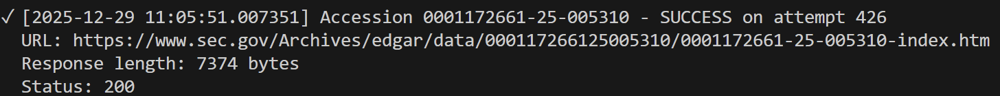
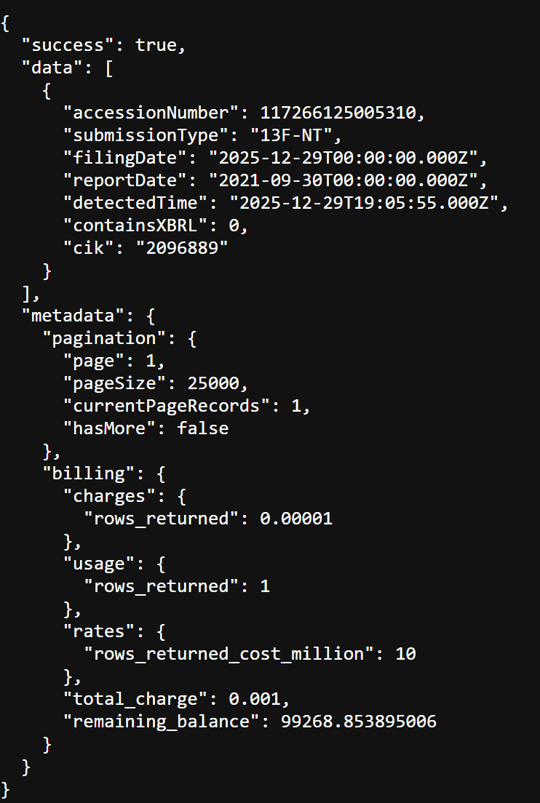

# The fastest way to get SEC filings

The current fastest (public) way to get notified of new SEC filings is by monitoring the SEC's RSS feed. There is (possibly) a faster way.

Disclaimer: This has been tested and works! NOTE: as of 10/5/2026, the SEC has patched this method! URL prediction still works, BUT you must now include CIK. This makes the problem much harder.

**Screenshots of 4s faster for a 13F-NT filing.**

Faster Method (time in PT)

RSS Method (time in UTC)


## Timeline of a SEC filing

Using: [GRAPHJET TECHNOLOGY 2025's 10-K](https://www.sec.gov/Archives/edgar/data/1879373/000121390025125488/0001213900-25-125488-index.htm)

| Event | Timestamp | Time Difference |
|-------|-----------|-----------------|
| Acceptance Datetime| Tue, 23 Dec 2025 22:25:42 GMT | - |
| Index eTag LMT| Tue, 23 Dec 2025 22:25:42 GMT | 0 seconds |
| SGML eTag LMT| Tue, 23 Dec 2025 22:26:21 GMT | 39 seconds |
| RSS feed updated | Tue, 23 Dec 2025 22:27:58 GMT | 2 minutes 16 seconds |

- Acceptance Datetime is when the SEC accepts a filing into EDGAR. The filing is not public at this point.
- Index is the index to a filing, created by EDGAR. [Link](https://www.sec.gov/Archives/edgar/data/1879373/000121390025125488/0001213900-25-125488-index.htm)
- SGML is the filing in its original Standardized Generalized Markup Language format. [Link](https://www.sec.gov/Archives/edgar/data/1879373/000121390025125488/0001213900-25-125488.txt)
- RSS is the RSS feed. [Link](https://www.sec.gov/cgi-bin/browse-edgar?company=&CIK=&type=&owner=include&count=40&action=getcurrent)

## Why this matters
The RSS feed references the index and sgml file. Therefore, it makes sense that the index and sgml file would be released first. This means that if one can predict the url of the index or sgml file, they can poll the url, and get filing data and metadata before the RSS. 

## How much faster

Simple sample of 100, taken on 12/23/25. Larger files, like 10-Ks, take longer.

| Metric | Filing Metadata | Filing Contents |
|--------|-----------------|-----------------|
| **25th Percentile** | 26.00 seconds | 0.00 seconds |
| **Mean** | 32.16 seconds | 3.78 seconds |
| **75th Percentile** | 36.00 seconds | 2.75 seconds |


## How to predict filing urls

Accession numbers follow the format {filer cik zfilled}-{year2D}-{typically sequential ordering of filings by that filer}. For example: 0001213900-25-125488.

Once you have the accession number you can construct the filing's index page: [https://www.sec.gov/Archives/edgar/data/{accession zfilled}/{accession no dash}-index.htm](https://www.sec.gov/Archives/edgar/data/000121390025125488/0001213900-25-125488-index.htm). This allows you to get the filing's metadata such as documents in the filing, filenames, etc.

Getting the filing in SGML form requires the company or entity's cik code. 
https://www.sec.gov/Archives/edgar/data/{cik}/{accession no dash}/{accession dash}.txt

This is not necessarily the same cik code in the accession! For example, `https://www.sec.gov/Archives/edgar/data/1879373/000121390025125488/0001213900-25-125488.txt` has accession cik code of `1213900` whereas the company's cik code is `1879373`

If you try: https://www.sec.gov/Archives/edgar/data/1213900/121390025125488/0001213900-25-125488.txt, it will not work.

```xml
<Error>
<Code>NoSuchKey</Code>
<Message>The specified key does not exist.</Message>
<Key>edgar/data/1213900/121390025125488/0001213900-25-125488.txt</Key>
<RequestId>N6HT139HBDX5KAW4</RequestId>
<HostId>dRarQn7DvzsNLsjQOOyKZb1RSKnORCZWiojlIE9pj22Km23w63aVj4Ko9hw382TpBAy6pvkgNUk=</HostId>
</Error>
```

## Simple Algorithm
1. Say you want a specific company.
2. Figure out its filer.
3. Use information from the RSS to get the last sequence number.
4. Poll the next five index pages.
5. Once index page is identified, begin polling the SGML file.


## Further improvements
There are ten entities that submitted 42% of filings in 2024. Since these entities file for many companies, that means that you can get all the filings for the companies they filed for with little work!

Simply poll the index page for forthcoming accession numbers, and when you hit the index page, extract the cik, then monitor the sgml file url using the accession + cik.

Making 10 requests per second (SEC max rate limit), you can beat the RSS feed by up to minutes for about half of filings!

## Caveat

The information in SEC filings are (typically) published on the company's website before being published by the SEC. To the best of my knowledge, this is not always the case. Some arbitrage opportunities here.
